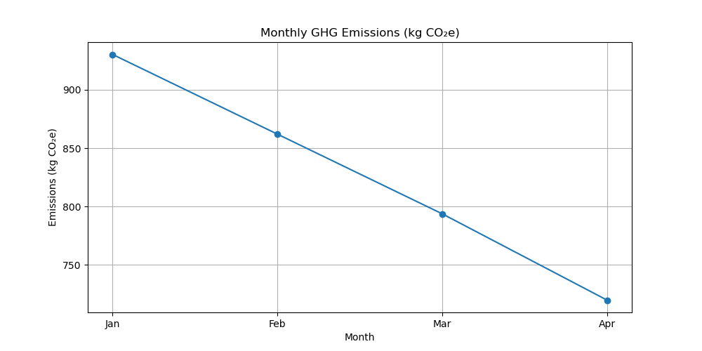

# GHG Emissions Dashboard

This project calculates monthly greenhouse gas emissions from electricity, natural gas, and water usage,
and plots a trend line.

## Contents
- [Overview](#overview)
- [Files](#files)
- [How to Run](#how-to-run)
- [Sample Output](#sample-output)
- [Author](#author)

## Files
- **ghg_data_sample.csv**: Sample input data (Month, kWh, therms, gallons)
- **ghg_dashboard.ipynb**: Jupyter Notebook with data calculations and plotting
- **emissions_plot.png**: Output chart of total emissions by month

## How to Use
1. Open `ghg_dashboard.ipynb` in Jupyter Notebook.
2. Run each cell in order:  
   - Import libraries  
   - Load `ghg_data_sample.csv`  
   - Compute emissions  
   - Plot and save `emissions_plot.png`
## Sample Output

## Author
Sristi Shreya  
Graduate Student, Energy Systems Engineering, UIUC
